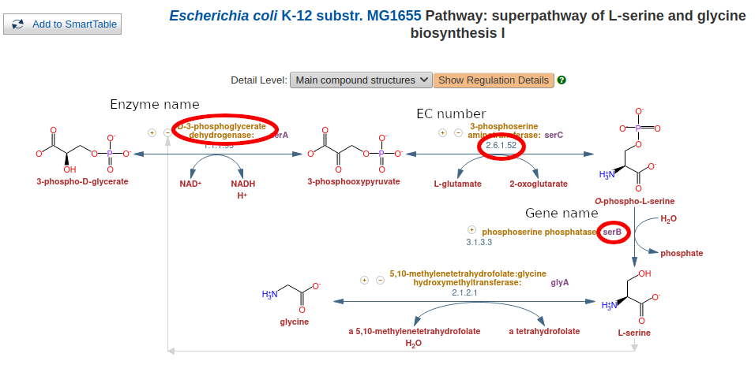

# Marine Microbiology: Computational pathway analysis

## Tutorial: Proteins in L-serine and L-glycine synthesis

The aim with this tutorial is to show you how to find proteins that you can search for as markers of a certain metabolism.
I will exemplify with synthesis of two small amino acids that are related to each other in how they're produced: L-serine and L-glycine.

Briefly, I will show how to find information about a pathway, identify enzymes that are good markers for the pathway and find search tools that you can apply to nucleotide sequence data such as metagenomes or metatranscriptomes.

### Pathway databases

The first step we will perform is to find information about the metabolic pathway used to synthesize the two amino acids.
Metabolic pathway information can be found primarily in two online databases: [Kyoto Encyclopedia of Genes and Genomes (KEGG)](https://www.kegg.jp) and the [BioCyc Database Collection](https://biocyc.org).
I'm going to use the latter, but I encourage you to also check out KEGG.

BioCyc is a collection of organism specific metabolic and genomic databases.
This means you choose which organism you want to work with (click the link "change organism database" in the top right corner) and then get access to information about its metabolic capacity (plus many more things!).
Different organisms have different metabolic capacities and may also differ in how pathways are built.
Besides the organism specific databases, [MetaCyc](https://metacyc.org) is a collection of *all* pathways.

To make things clearer, I will use the *E. coli* K-12 database [EcoCyc](https://ecocyc.org) in this tutorial, even though MetaCyc would give us a more complete picture.

#### Finding the L-serine and L-glycine synthesis pathway in *E. coli*

* Open [EcoCyc](https://ecocyc.org)

* Search for "glycine" (top right corner)

* Select "superpathway of L-serine and glycine biosynthesis I" under "Pathways"

* Change "Detail level" to "Main compound structures"

In the above pathway you can see how L-serine is synthesized from 3-phospho-D-glycerate in three steps.
A key step is when the amino group in L-serine is donated from a glutamate in step two.
After L-serine is synthesized, L-glycine is synthesized by extraction of the side chain, making it four steps for the total pathway.

I have marked three key concepts with red ellipses: The enzyme/protein name, the gene name and the Enzyme Commission (EC) number.
They will be important when we start searching for the enzymes and proteins.

It is a bit of an art to study a pathway and identify which steps and enzymes might be good candidates as markers for the pathway, as, in many cases, different pathways cross each other so that reactions and compounds participate in many pathways.
Moreover, reactions in pathways do not necessarily run in only one direction but are equilibrium reactions whose direction are determined by the concentrations of compounds on either side of the reaction.
In the L-serine and L-glycine pathway as described in EcoCyc, you can see that all arrows except one have arrowheads on both sides, indicating they're equilibrium reactions.

In the example above, there are no enzymes that consist of more than one protein, although this is rather common.

An example of how reactions with multicomponent enzymes look.
Besides two genes coding for proteins in the enzyme, there are two, paralogous pairs: *nrdA/nrdB* and *nrdE/nrdF* respectively.

### Protein databases

From knowledge about the pathway, we can step down into the enzymes and proteins that take part in catalyzing each reaction.

There are many databases that store protein sequences with annotations; the NCBI collection is perhaps the best known.
[Uniprot](uniprot.org) is, in my opinion, better structured than the other alternatives.
It consists of two parts, SwissProt, which is manually curated, and TrEMBL, which is not and only relies on computational annotation.

One can search Uniprot for values in specific fields, by clicking the little grey link "Advanced" next to the "Search" button at the top right.
You can for instance search for the gene name "serA" and taxonomy "Bacteria":

The result will look like this:

Clicking on a single entry, will give you a lot of information about this particular protein.

### Protein profile databases

When you use BLAST to search for similar sequences, you use a single sequence as template.
This works fine when target sequences are relatively similar, but not so well for homologs that have diverged as similarity can become very low even between related sequences.
Moreover, BLAST uses a scoring scheme that treats each position in a protein identically even though we know that certain positions in the amino acid sequence will vary more than other.
Statistical profiles are more sensitive search tools than single sequences.
They are made from alignments of multiple sequences and consist of probabilities for observing a specific amino acid at a specific position of a protein.
The residues that vary little between homologous proteins from different organisms will have high probabilities for a few amino acids, whereas positions that vary more between proteins will have smaller probabilities for a larger number of amino acids.

There are (at least) three databases that contains profiles that you can download and use to search for proteins in your own dataset: [Pfam](http://pfam.xfam.org/), [TIGRFAM](http://tigrfams.jcvi.org/) (has been inaccessible for a while) and [EGGNOG](http://eggnog5.embl.de/).
The philosophies differ a little between the three, but they are all useful.
For some proteins you may find that the Pfam profile is the best, but for another you might choose one of the other two.
