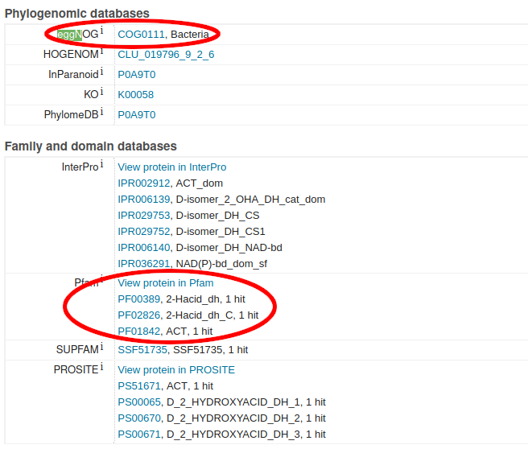

# Marine Microbiology: Computational pathway analysis

# Overview

This tutorial is meant to be performed in steps. 
After each of the steps, take some time to try it out yourself; there are suggestions for exercises after each main section.

1. Learn about [pathway databases](#pathway-databases) ([exercise](#pathway-database-exercise))

2. Learn about [protein databases](#protein-databases) ([exercise](#protein-database-exercise))

3. Learn about [protein profile search tools and databases](#protein-profile-databases) ([exercise](#protein-profile-exercise))

4. Scan the [TARA Oceans Gene Atlas](#testing-your-profiles) for your pathway ([exercise](#ocean-gene-atlas-exercise))

# Tutorial: Proteins in L-serine and L-glycine synthesis

The overall aim with this tutorial is to give some insight in how to annotate genomes and find positive evidence for the presence or absence of metabolic pathways.
In the most general case, genomes are annotated by searching for genes, i.e. stretches of nucleotides coding for a protein or a functional RNA molecule.
The genes are then searched for and aligned with genes from other genomes and given a name -- plus in many cases a set of codes to associate it with other sources of information -- taken from one or more similar proteins.
This search is performed with BLAST or similar tools and starts with the sequences of the genome being annotated.
The approach is suitable as a starting point, but if one wants more certain information about e.g. a specific pathway, one often has to turn the approach around and look for the proteins involved in the pathway with more sensitive tools than BLAST.

This tutorial will show you how to find proteins that you can search for as markers of a certain metabolism.
I will exemplify with synthesis of two small amino acids that are related to each other in how they're produced: L-serine and L-glycine.

Briefly, I will show how to find information about a pathway, identify enzymes that are good markers for the pathway and find search tools that you can apply to nucleotide sequence data such as metagenomes or metatranscriptomes.

## Pathway databases

The first step we will perform is to find information about the metabolic pathway used to synthesize the two amino acids.
Metabolic pathway information can be found primarily in two online databases: [Kyoto Encyclopedia of Genes and Genomes (KEGG)](https://www.kegg.jp) and the [BioCyc Database Collection](https://biocyc.org).
I'm going to use the latter, but I encourage you to also check out KEGG.

BioCyc is a collection of organism specific metabolic and genomic databases.
This means that you choose which organism you want to work with (click the link "change organism database" in the top right corner) and then get access to information about its metabolic capacity (plus many more things!).
Different organisms have different metabolic capacities and may also differ in how pathways are built.
Besides the organism specific databases, [MetaCyc](https://metacyc.org) is a collection of *all* pathways.

To make things simpler, I will use the *E. coli* K-12 database [EcoCyc](https://ecocyc.org) in this tutorial, even though MetaCyc would give us a more complete picture.

### Finding the L-serine and L-glycine synthesis pathway in *E. coli*

* Open [EcoCyc](https://ecocyc.org)

* Search for "glycine" (top right corner)

* Select "superpathway of L-serine and glycine biosynthesis I" under "Pathways"

* Change "Detail level" to "Main compound structures"

In the above pathway you can see how L-serine is synthesized from 3-phospho-D-glycerate in three steps.
A key step is when the amino group in L-serine is donated from a glutamate in step two.
After L-serine is synthesized, L-glycine is synthesized by extraction of the side chain, making it four steps for the total pathway.

I have marked three key concepts with red ellipses: The enzyme/protein name, the gene name and the Enzyme Commission (EC) number.
They will be important when we start searching for the enzymes and proteins.

You can click on the arrows to find out more about a reaction.
Important pieces of information on reaction pages are the pathways a reaction participates in; *compare* the first reaction with the last in the above example.

It is a bit of an art to study a pathway and identify which steps and enzymes might be good candidates as markers for the pathway, as, in many cases, different pathways cross each other so that reactions and compounds participate in many pathways.
Moreover, reactions in pathways do not necessarily run in only one direction but are equilibrium reactions whose direction are determined by the concentrations of compounds on either side of the reaction.
In the L-serine and L-glycine pathway as described in EcoCyc, you can see that all arrows except one have arrowheads on both sides, indicating they're equilibrium reactions.
This is in itself not a show-stopper when it comes to finding good protein markers for pathways as it's not uncommon that equilibrium reactions predominantly go in one direction.
One can, for example, assume that concentrations of glycine and 5,10-tetrahydrofolate are normally not sufficient to drive the reaction to the right in the above scheme.
In the "pathway summary" below the pathway diagram in EcoCyc, they mention that 5,10-tetrahydrofolate is the "the major source of one-carbon units in many organisms", which likely means it's used up for synthesis of other compounds relatively rapidly.

In the example above, there are no enzymes that consist of more than one protein, although this is rather common.
The below shows how that looks.

Besides two genes coding for two different proteins in the enzyme, there are two, paralogous pairs in the *E. coli* genome: *nrdA/nrdB* and *nrdE/nrdF* respectively.

### Pathway database exercise

Search [Metacyc](https://metacyc.org) or [EcoCyc](https://ecocyc.org) for any of the following pathways:

* Calvin-Benson cycle

* Vitamin B12 synthesis (can *E. coli* make B12?)

* PHB synthesis (what is this?)

* Aromatic amino acid synthesis

## Protein databases

From knowledge about the pathway, we can step down into the enzymes and proteins that take part in catalyzing each reaction.

There are many databases that store protein sequences with annotations; the NCBI collection is perhaps the best known.
[Uniprot](uniprot.org) is, in my opinion, better structured than the other alternatives.
It consists of two parts, SwissProt, which is manually curated, and TrEMBL, which is not and only relies on computational annotation.

One can search Uniprot for values in specific fields, by clicking the little grey link "Advanced" next to the "Search" button at the top right.
You can for instance search for the gene name "serA" and taxonomy "Bacteria":

The result will look like this:

Clicking on a single entry, will give you a lot of information about this particular protein.

If you click on the top entry (the *E. coli* protein) and scroll down (or search for "EGGNOG" which I did), you will see this:

Uniprot entry for *serA* in *E. coli*.
I have marked the eggNOG and Pfam parts, that can be used as sources of profiles for finding proteins.
If the entry had a TIGRFAM, you would find that under "Family and domain databases", just like Pfam.
(I don't know why eggNOG is under "Phylogenomic databases" and Pfam and TIGRFAM are under "Family and domain databases".)

### Protein database exercise

Look up some of the enzymes from the pathway you chose in the [pathway database exercise](#pathway-database-exercise).

## Protein profile databases

When you use BLAST to search for similar sequences, you use a single sequence as template.
This works fine when target sequences are relatively similar, but not so well for homologs that have diverged a lot, as similarity can become very low even between related sequences.
Moreover, BLAST uses a scoring scheme that treats each position in a protein identically even though we know that certain positions in the amino acid sequence will vary more than other.

Statistical profiles, known as *H*idden *M*arkov *M*odels (HMM) are more sensitive search tools than single sequences.
They are made from alignments of multiple sequences and consist of probabilities for observing a specific amino acid at a specific position of a protein.
The residues that vary little between homologous proteins from different organisms will have high probabilities for a few amino acids, whereas positions that vary more between proteins will have smaller probabilities for a larger number of amino acids.

HMMs can be visualized as "sequence logos", where the probability for observing different amino acids is reflected in heights of letters.
The total height of a pile of letters is the "information content" (strength of signal) for that position, and the relative height of each letter is the probability for that amino acid.
This is an example of a profile made from NrdR ATP-cone sequences, just serving as an example of how a relatively short profile can be visualized.

There are (at least) three databases that contains profiles that you can download and use to search for proteins in your own dataset: [Pfam](http://pfam.xfam.org/), [TIGRFAM](http://tigrfams.jcvi.org/) (has been inaccessible for a while) and [EGGNOG](http://eggnog5.embl.de/).
The philosophies differ a little between the three, but they are all useful.
For some proteins you may find that the Pfam profile is the best, but for another you might choose one of the other two.

Proteins in Uniprot are scanned for the presence of Pfam, TIGRFAM and EGGNOG profiles.
This is visible when you open the page for an individual protein, but you can also tailor the table view by clicking the pencil icon at the top right corner of the table:

In the dialog that follows, you can select whichever columns you want to display, adding e.g. "eggNOG" (under "Phylogenomic", under "Databases"), "Pfam" and "TIGRFAMs" (both under "Family and domain", under "Databases").
After adding those three, click "Save" and your table should look like this:

### Selecting a profile for a protein

Selecting a suitable profile for a pathway involves a couple of steps, and is a process that sometimes takes a few iterations to get right.
Here, we're going to start with the simpler task of finding a suitable profile for a protein and then evaluate whether the profile is suitable also as an indicator of a specific pathway.

In the table of Uniprot hits for the *serA* gene you can see that the first and third entry both have "COG0111" in the eggNOG column and "PF00389", "PF02826" and "PF01842" in the Pfam column, whereas the second entry does not.
You can also see that the second entry has a different protein name than the other two.
Together, the difference in profiles and protein name, suggests that the second entry is something else than number one and three.
Moreover, the protein name of the second entry, "Selenate reductase subunit alpha", does not fit with the MetaCyc reaction we started out with, that should be catalyzed by an enzyme called "D-3-phosphoglycerate dehydrogenase" like entries one and three.

After disregarding entry two, we can start thinking about which of the profile options common between entries one and three is the best choice.
First of all, it's quite common that there is more than one Pfam profile, whereas this is not as common for eggNOGs and TIGRFAMs (although it happens also with them).
The reason is that Pfam focuses on domains, i.e. individually folding parts of proteins, rather than full length proteins.
Quite often, domains occur in different combinations in different proteins, which explains Pfam's choice to focus on domains.
A domain profile can, carefully selected, target only the important part of a protein that catalyzes a reaction, where a profile for a full length protein might include for the reaction non-essential parts of proteins.
The latter might render a profile for full length proteins *too specific* so that it misses some proteins that do the same thing but lack certain parts that the profile includes.
Therefore, I often start by looking at Pfam profiles for searches.

The problem then becomes, which Pfam profile to choose.
If you click on the link for the "PF00389" profile, you come to a page describing a family of domains called "D-isomer specific 2-hydroxyacid dehydrogenase, catalytic domain" -- sounds pretty good to me!
The other two profiles, "PF02826" and "PF01842" respectivelly, are called "D-isomer specific 2-hydroxyacid dehydrogenase, NAD binding domain" and "ACT domain" respectivelly.
The latter is further described as "found in a variety of proteins involved in metabolism" -- not very promising.
The "NAD binding domain" part of the name of "PF02826" is also indicating it might not be as specific to this particular enzyme as the first profile, as NAD is a common cofactor in enzymes.
In this case we hence select "PF00389" to continue with.

To verify that the Pfam "PF00389" describes "D-3-phosphoglycerate dehydrogenase" and no other proteins, one can search Uniprot for this Pfam using the "Advanced" link at the top that we formerly used to search for gene names.
You'll find Pfam under "Cross-references/Family and Domain Databases"; I'm specifying "Bacteria" under "Taxonomy" too.
The result should look like this (after adding the "EC number" column from the table "pencil" menu):

As you can see, there are a lot of different protein names and E.C. numbers (E.C. stands for "Enzyme Commission" and is a system for classification of enzymes; one reaction/enzyme, one E.C. number), indicating that the PF00389 is not at all specific for the reaction we targeted!
So, despite the profile being called almost exactly the same as the protein we were targetting, it is not sufficiently specific for this protein.

At this point, you have two choices: Check what the "COG0111" targets in a similar way as we did with "PF00389" or turn to another reaction, enzyme and protein in the pathway.
If you have a lot of other reactions to choose from in the pathway you're targeting, you might want to go directly at the second option and go for the next reaction.
If not, check the COG0111.

*To continue:* After you have checked if "COG0111" might be a good tool for identification of this protein, please check the other enzymes in the pathway and see if you can find a good signature protein for the pathway.
Note that you can also search with the E.C. number at Uniprot.
This might be a better choice than the gene name in some cases, but note that the E.C. number will be shared by all proteins catalyzing a reaction.
If an enzyme consists of multiple proteins or different, non-homologous, proteins catalyze the reaction, all will have the same E.C. number.

### Protein profile exercise

Find profiles for some of the enzymes from the pathway you looked up in the [protein database exercise](#protein-database-exercise).

## Testing your profiles

The TARA Oceans project has collected a lot of metagenomic and metatranscriptomic sequences, which has been turned into gene catalogs.
These gene catalogs can be searched at the [Ocean Gene Atlas](http://tara-oceans.mio.osupytheas.fr/ocean-gene-atlas/).
There are multiple ways of searching the catalog, e.g. BLAST with a single sequence (option no. 1) or HMM profiles, either uploading your own (no. 2) or through Pfam accessions (no. 3).

Note that you can choose either a metagenomic or a -transcriptomic database, so you can study either the functional potential in a sample or the realization of that potential.
You can also select either a prokaryotic ("OM-RGC") or a eukaryotic ("MATOU") database.

When you have decided on one or more profiles to use as markers for your metabolism, you can download them and search the TARA database or, for the Pfam profiles, just use their Pfam accessions (e.g. PF00389).
The result should look something like this:

The above shows you some overall statistics like the number of hits, plus a navigation bar to the left.

*Note* the link to "User manual".

Scrolling down a bit shows you the geographic distribution of hits, *divided by filter fraction*:

(*Note* that you can select different depths in the above figures.
DCM is short for Deep Chlorophyll Maximum, SRF is Surface, MES is mesopelagic, MIX is marine epipelagic mix layer and ZZZ is marine water layer.
Which exact depth in meters these classes correspond to differs from site to site and sometimes even between times of the year.)

Even further down, you get a taxonomical breakdown of hits in a *Krona* diagram:

(The Krona diagram can be analyzed by hovering your mouse pointer over its parts.)

### Ocean Gene Atlas exercise

Search the [Ocean Gene Atlas](http://tara-oceans.mio.osupytheas.fr/ocean-gene-atlas/) for the profiles you found in [protein profile exercise](#protein-profile-exercise).
